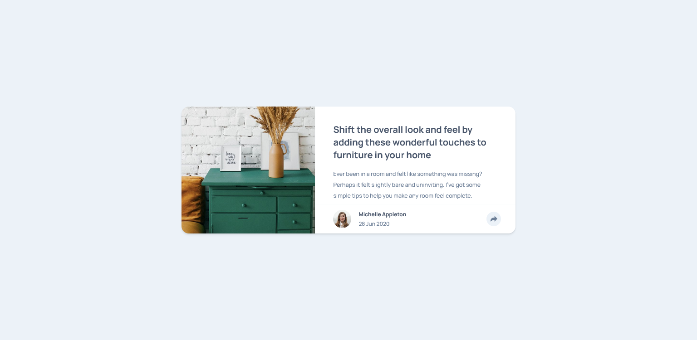

# Frontend Mentor - Article Preview Component Solution

This is a solution to the [Article Preview Component Challenge on Frontend Mentor](https://www.frontendmentor.io/challenges/article-preview-component-dYBN_pYFT). Frontend Mentor challenges help you improve your coding skills by building realistic projects. 

## Table of contents

- [Overview](#overview)
  - [The challenge](#the-challenge)
  - [Screenshot](#screenshot)
  - [Links](#links)
- [My process](#my-process)
  - [Built with](#built-with)
  - [What I learned](#what-i-learned)
  - [Continued development](#continued-development)
- [Author](#author)

## Overview

### The challenge

The [challenge](https://www.frontendmentor.io/challenges/profile-card-component-cfArpWshJ) was to build out this article preview component and get it looking as close to the design as possible.

Users should be able to:

- View the optimal layout for the component depending on their device's screen size.
- See the social media share links when they click the share icon.

### Screenshot

### Links

- Frontend Mentor Solution
- [Live Site](https://frontend-mentor-newbie-projects.github.io/04-article-preview-component/)

## My process

### Built with

HTML5 + CSS | Flexbox + Grid | CSS Grid using a mobile-first workflow.

### What I learned

Major learnings while working on this project were:

- WIP

### Continued development

This solution is still a WIP, for the following reasons:

- WIP

Attempting this challenge highlighted some areas I would like to continue perfecting:

- WIP

## Author

- Frontend Mentor - [@likelytwitchdollop](https://www.frontendmentor.io/profile/likelytwitchdollop)

